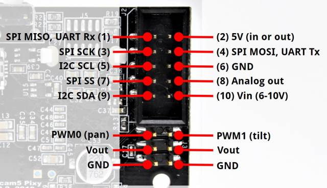

# pixy2

This PXT package allows the BBC micro:bit to talk to the [pixy2](https://pixycam.com/pixy2/) cam using the [SPI](https://www.corelis.com/education/tutorials/spi-tutorial/)/I2C interface. The [pixy2 github](https://github.com/charmedlabs/pixy2) already has a [C++ implementation](https://github.com/charmedlabs/pixy2/tree/master/src/host/arduino/libraries/Pixy2) to talk to the Arduino board through the SPI/I2C interface. The package ports the Arduino code using [the porting guide](https://docs.pixycam.com/wiki/doku.php?id=wiki:v2:porting_guide#SPI), modifies some of the code and builds it for the micro:bit target. The package was built for the "Hands-On Computing" course at UCSD.

## Usage

The package can be imported as an extension in the MakeCode editor. If you would like to make some changes and import the local version, please follow the [Developer Setup](#developer-setup) instructions, build the project and import the `binary.hex` file from the `built` directory

Check the official pixy documentation for the [General API](https://docs.pixycam.com/wiki/doku.php?id=wiki:v2:general_api), [Color Connected Components API](https://docs.pixycam.com/wiki/doku.php?id=wiki:v2:ccc_api), [Line tracking API](https://docs.pixycam.com/wiki/doku.php?id=wiki:v2:line_api), and [Video API](https://docs.pixycam.com/wiki/doku.php?id=wiki:v2:video_api). You can also find the documentation for all the above APIs in [pixy2.cpp](pixy2.cpp).

Some custom functions which use the above APIs to simplify the Pixy2 usage can be found in [pixy2.ts](pixy2.ts) file.

## Developer Setup

1. Install PXT. Follow the instructions from [MakeCode CLI](https://makecode.com/cli)
2. Clone this repository and run the following commands to build the repo

    ```bash
    cd pxt-pixy2  # Go into the cloned repo
    pxt target microbit  # Downloads the micro:bit target (node_modules)
    pxt install  # Installs the core libraries of the micro:bit
    pxt build  # Builds the hex file in built/binary.hex
    ```

3. If any changes are made (please make in a separate branch and create a PR if necessary), run the following commands to push the changes

    ```bash
    pxt buildshims # Builds the shims.d.ts and enums.d.ts files. This command makes a call to MakeCode where the C++ compilation happens.
    pxt build
    pxt bump  # Bumps the version of the extension and pushes the changes to GitHub
    ```

## Connections

To use this package, a Pixy2 cam, a micro:bit and an expansion board is required. Make the following connections using the figures below

Pixy2 pins             |  Microbit Pins
:-------------------------:|:-------------------------:
Pin 6 | GND
Pin 1 (SPI MISO) | P14
Pin 4 (SPI MOSI) | P15
Pin 3 (SPI SCK) | P13
Pin 2 (5V) | 3V
| 

## General Guide for writing extensions

This section is intended for folks looking to port or write their own extensions for PXT targets (specifically the micro:bit). The documentation isn't that great (there are a lot of missing links) and only got this package to work through a lot of trial and error.

### Micro Bit basics

The micro:bit [wiki](https://en.wikipedia.org/wiki/Micro_Bit) gives information about the hardware and the software, but the main thing to note is that it runs the [arm MBED OS](https://github.com/ARMmbed/mbed-os). Lancaster University provides the [microbit](https://github.com/lancaster-university/microbit) and [microbit-dal](https://github.com/lancaster-university/microbit-dal) repositories which is written in `C++` and make up the core runtime.

If we look at [MakeCode for the Micro:Bit](https://makecode.microbit.org/), it gives us a lot of functionality on top of the basic available runtime. The code is present in the [pxt-microbit](https://github.com/microsoft/pxt-microbit/tree/master/libs) repository. From the repository README, `pxt-microbit is a Microsoft Programming Experience Toolkit (PXT) target that allows you to program a BBC micro:bit.` If we take a look at the [pxt](https://github.com/microsoft/pxt) README, it tells us how TypeScript is the underlying programming language.

```text
Microsoft MakeCode is based on the open source project Microsoft Programming Experience Toolkit (PXT). Microsoft MakeCode is the name in the user-facing editors, PXT is used in all the GitHub sources.

PXT is a framework for creating special-purpose programming experiences for beginners, especially focused on computer science education. PXT's underlying programming language is a subset of TypeScript (leaving out JavaScript dynamic features).

The main features of PXT are:
    a Blockly-based code editor along with converter to the text format
    a Monaco code editor that powers VS Code extensibility support to define new blocks in TypeScript
    an ARM Thumb machine code emitter
    a command-line package manager
```

This causes a bit of confusion. But upon closer inspection, you will find that there are cpp files and those files have the actual implementation. So, MakeCode essentially expanded the Lancaster University core runtime, by adding a lot of functionality using cpp files. But to make it easier for programming, MakeCode uses [shims](https://stackoverflow.com/questions/2116142/what-is-a-shim), where a TypeScript interface is created that interacts with the underlying C++ code. I don't know the exact workings, but this much information is sufficient.

### Creating Extensions

Now we can finally talk about how to create extensions. [MakeCode extensions](https://makecode.com/extensions) gives us most of the details on how to create the extension, but the above background information is missing. There are two ways to create extensions

1. Directly write a `.ts` file with the required implementation using all the available functions that MakeCode provides, without needing to build shims
2. Write C++ code using the header files available from `ARMmbed/mbed-os`, `lancaster-university/microbit`, `lancaster-university/microbit-dal`, `microsoft/pxt`, `microsoft/pxt-microbit`,  and build shims.d.ts and enums.d.ts files. The `pxt buildshims` command builds the required shims on some MakeCode server where the whole pipeline has been setup. Check [Trials and Tribulations](#trials-and-tribulations) for some issues I faced while porting the C++ code for this extension.

To build for both the methods, simply follow the instructions in [Developer Setup](#developer-setup).

## Trials and Tribulations

I haven't had a lot of experience writing C++ code for large programs. So it took me a bit of trial and error, and time to figure out how to get things to work. I hope to save people the trouble.

1. You can only `#include` header files and not cpp files since it leads to definition clashes
2. You can use any header file avaialble in the repositories mentioned in [Creating Extensions](#creating-extensions). I tried using standard library functions like printf, but it didn't work, so I would advice against that
3. `#include pxt.h` should be sufficient for most cases since it contains all the available namespaces. If you would like to use a function inside a namespace that hasn't been defined in pxt.h, you can simply provide the function definition in your header file and you should be able to use it. Check [Pixy2.h](Pixy2.h), where `spiTransfer` and `spiFormat` functions were not defined in pxt.h. However, the functions were defined in [pins.cpp](https://github.com/microsoft/pxt-microbit/blob/master/libs/core/pins.cpp#L555) in the pxt-microbit repo.
4. Ensure you are using the proper namespace for everything. Asserting this, wasted a lot of time because of this.
5. The porting required changing some functions present in Arduino to functions present on the micro:bit, like using `sleep_us` instead of `delayMicroSeconds` and `current_time_ms` instead of `millis`. If you are porting, keep such things in mind.
6. The final cpp file that will be shimmed needs to have the same name as your extension name, should define the namespace, provide proper documentation, and have all the correct keywords to enable block usage.
7. I couldn't figure out how to get an automatic translation of struct files in C++ to the shims.d.ts. It doesn't look plausible and I searched a lot of online repos for this. In the end, I thought that the best way would be to just convert all the outputs into a comma-separated `pxt::String` type since that can be converted to typescript string. Then, I can manually reconstruct the object in pixy2.ts file for normal use. Seems so unnecessarily complicated :/

## License

GNU

```text
pixy2=github:charmedlabs/pixy2
```

MIT

```text
pxt-pixy2=github:vchelur97/pxt-pixy2
```

## Supported targets

- for PXT/microbit

(The metadata above is needed for package search.)

## Disclaimer

The code has not been thoroughly tested and is simply a port of the official pixy2 library for the Arduino. I am not responsible for any damage caused due to using this code.
